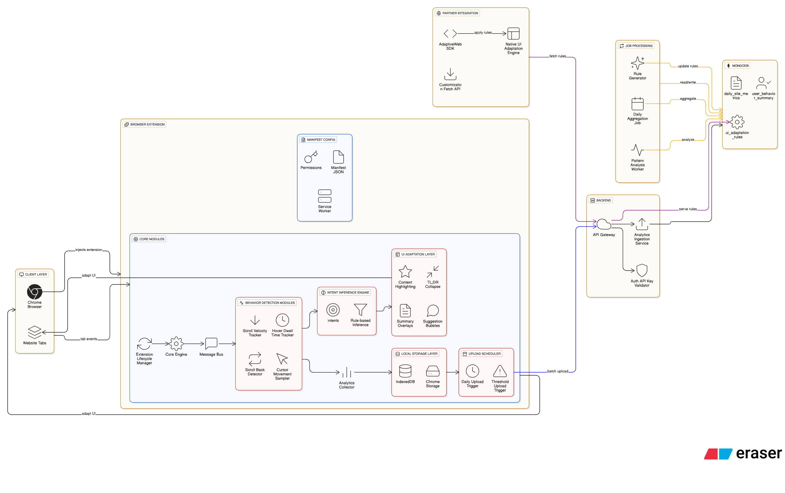

# AdaptiveWeb 🌐

**Real-Time Intelligent UI Adaptation via Micro-Behavior Analysis**

> A modular browser extension + backend system that detects user micro-behaviors and adapts web interfaces in real time using rule-driven intelligence.


---

## 📌 What is AdaptiveWeb?

**AdaptiveWeb** is an intelligent UI adaptation layer that observes **user micro-behaviors** (scrolling, hovering, cursor hesitation, dwell time) and dynamically adjusts web interfaces to reduce cognitive load and improve navigation efficiency.

Unlike traditional personalization tools, AdaptiveWeb:

* Works **without user configuration**
* Operates **non-intrusively**
* Adapts interfaces **in real time**
* Uses **rule-based intent inference**, not invasive tracking

---

## 🎯 Core Capabilities

* Detects **user intent** from behavior signals
* Applies **contextual UI adaptations**
* Supports **client-only mode** and **rule-driven backend mode**
* Designed for **high performance & privacy**

---

## ✨ Key Features

### 🎨 Hover Dwell Highlight

Highlights content the user is actively reading.

* Trigger: Hover > **1500 ms**
* Effect: Soft highlight with fade-out
* Goal: Visual confirmation of focus

---

### 📋 Scroll-Back Auto Summary

Displays a contextual summary when users scroll back.

* Trigger: Scroll down → quick scroll up
* Effect: Floating summary overlay
* Goal: Reduce re-reading effort

---

### ⚡ Rapid Skimming (TL;DR Mode)

Condenses long content during fast scrolling.

* Trigger: Multiple rapid scrolls
* Effect: Paragraphs collapse with “Read more”
* Goal: Faster information scanning

---

### 🤔 Cursor Hesitation Assistance

Detects uncertainty and offers guidance.

* Trigger: Low cursor variance / circular movement
* Effect: Suggestion bubble near cursor
* Goal: Reduce friction & confusion

---

## 🧠 High-Level Architecture

```
Browser (Client)
 └─ Chrome Extension
     ├─ Behavior Detection Modules
     ├─ Intent Inference Engine
     ├─ UI Adaptation Layer
     ├─ Local Analytics Buffer
     └─ Upload Scheduler
          ↓
Backend (Optional)
 ├─ API Gateway
 ├─ Analytics Ingestion
 ├─ Pattern Analysis Jobs
 ├─ Rule Generator
 └─ MongoDB (Adaptation Rules)
          ↓
Partner Integration
 └─ AdaptiveWeb SDK / UI Adaptation Engine
```

---


## �  Architecture Diagram

> Full system flow including client, backend, jobs, and partner integration.



---

## 🧱 Component Breakdown

| Layer   | Component               | Responsibility                        |
| ------- | ----------------------- | ------------------------------------- |
| Client  | Behavior Detection      | Capture scroll, hover, cursor signals |
| Client  | Intent Inference Engine | Rule-based intent classification      |
| Client  | UI Adaptation Layer     | DOM & CSS mutations                   |
| Client  | Local Storage           | IndexedDB + Chrome Storage            |
| Client  | Upload Scheduler        | Batched analytics uploads             |
| Backend | API Gateway             | Secure ingestion endpoint             |
| Backend | Analytics Service       | Event processing                      |
| Backend | Job Processing          | Pattern analysis & rule generation    |
| Backend | MongoDB                 | Adaptation rules & summaries          |
| Partner | SDK / UI Engine         | Rule-driven UI application            |

---

## 📁 Project Structure

```
adaptiveweb/
├── extension/
│   ├── manifest.json
│   ├── content_script.js
│   ├── injected.js
│   ├── injected.css
│   └── icons/
│
├── backend/
│   ├── api-gateway/
│   ├── analytics-service/
│   ├── jobs/
│   └── database/
│
├── docs/
│   ├── PRD.md
│   ├── ARCHITECTURE.md
│   ├── SECURITY.md
│   └── TESTING.md
│
├── demo/
│   ├── index.html
│   └── test.js
│
└── README.md
```

---

## 🚀 Installation (Chrome Extension)

```bash
git clone https://github.com/yourusername/adaptiveweb.git
cd adaptiveweb
```

1. Open `chrome://extensions`
2. Enable **Developer Mode**
3. Click **Load unpacked**
4. Select the `extension/` directory

✅ AdaptiveWeb activates automatically on all pages.

---

## ⚙️ Configuration

```js
window.AdaptiveWeb.init({
  hoverDelay: 1500,
  highlightDuration: 3000,
  scrollBackWindow: 3000,
  skimScrollCount: 3,
  tldrLength: 120,
  cursorBufferSize: 20,
  varianceThreshold: 5000,
  debug: false
});
```

---

## 📊 Performance Targets

| Metric           | Target        |
| ---------------- | ------------- |
| Script load      | < 100 ms      |
| Memory usage     | < 5 MB        |
| Scroll FPS       | 60 FPS        |
| Event throttling | Yes           |
| DOM safety       | WeakMap-based |

---

## 🔒 Privacy & Security

* ✅ Client-side first architecture
* ✅ No raw user data stored
* ✅ No third-party trackers
* ✅ Batched + anonymized analytics
* ✅ API key validation (backend)

---

## 🧪 Testing

```bash
cd demo
python -m http.server 8000
```

Test scenarios:

* Hover dwell → highlight
* Scroll back → summary
* Rapid scroll → TL;DR
* Cursor hesitation → suggestion

---

## 🛣️ Roadmap

### Phase 2

* ML-based intent scoring
* Personal behavior baselines
* Accessibility-focused adaptations

### Phase 3

* Rule editor dashboard
* AI summarization (optional)
* Cross-site adaptation profiles

---

## 🤝 Contributing

1. Fork the repo
2. Create a feature branch
3. Commit clean, documented code
4. Open a Pull Request

---

## 📄 License

MIT License © AdaptiveWeb

---

## 📬 Contact

For feedback, ideas, or collaboration — open an issue.

---

**AdaptiveWeb — Making the web adapt to humans, not the other way around.** 🌐✨
